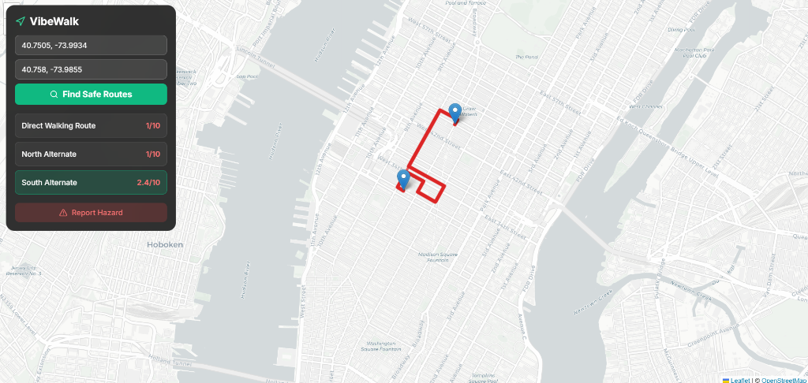
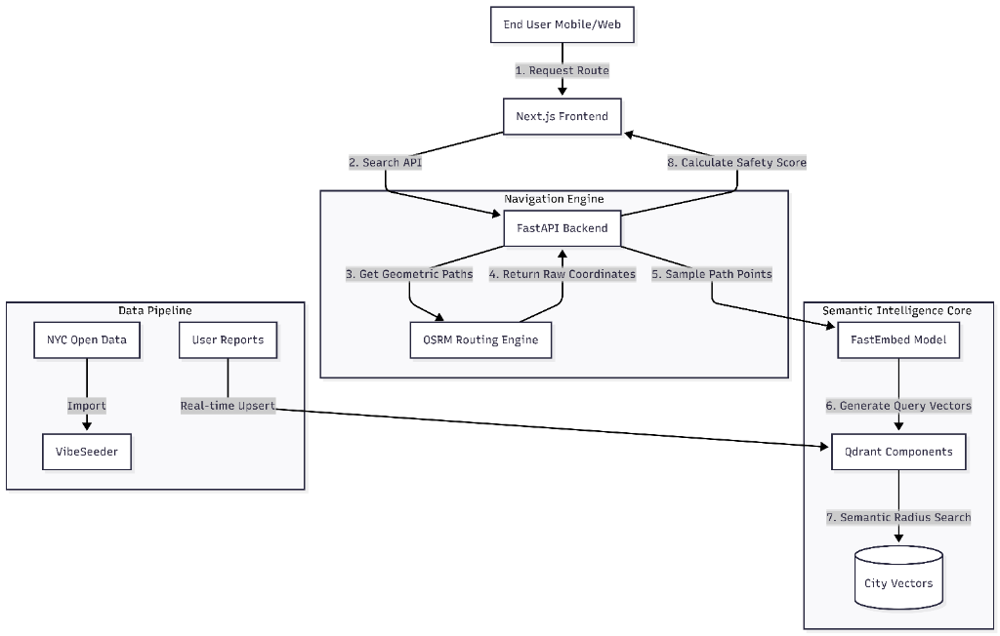
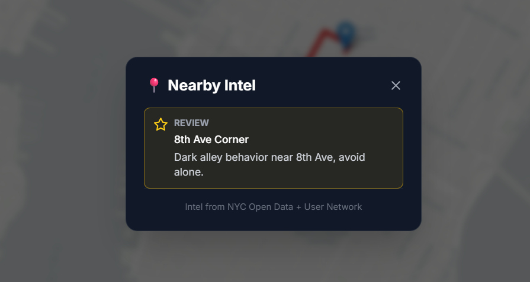
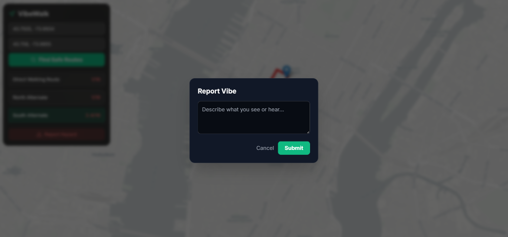
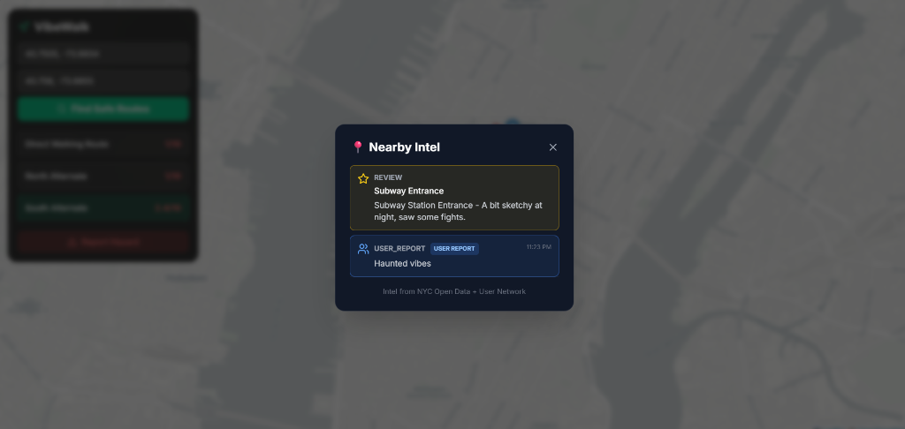

# VibeWalk: AI-Powered Safety Navigation System
## System Design & Technical Report (Convolve 4.0 Submission)

**Project Name:** VibeWalk  
**Submission Category:** Semantic Search & Vector Memory Systems  
**Primary Engine:** Qdrant Vector Database  

---

## 1. Problem Statement

### 1.1 Societal Issue: The Safety Gap in Navigation
Conventional navigation apps (Google Maps, Waze) optimize primarily for **speed** and **efficiency**. They calculate the shortest path from A to B, often routing pedestrians through unlit alleyways, high-crime zones, or construction sites without warning.

For vulnerable groups **women, children, and the elderly** the "fastest" route is not always the best route. "Safety" is subjective and hyper local; a street that feels safe at 2 PM might be terrifying at 10 PM.

### 1.2 Impact
*   **Fear of Movement**: 45% of women report avoiding walking alone at night due to safety concerns.
*   **Information Asymmetry**: Crime data exists (e.g., NYC Open Data), but it is buried in CSV files, not integrated into daily navigation tools.
*   **Static Data Failure**: Official crime statistics are lagging indicators. They don't capture real-time temporary hazards like a broken streetlight, a gathered crowd, or harassment incidents that go unreported to police.

### 1.3 The Solution: VibeWalk
VibeWalk is a **"Safety-First" Semantic Navigation System**. Instead of optimizing for distance, it optimizes for **"Vibe" (Semantic Safety Score)**. It uses **Qdrant** to store and retrieve dense vector representations of the city combining hard crime stats, positive place reviews, and real-time user reports to route users through the safest, most comfortable paths.


*Figure 1: VibeWalk generating safe routes using semantic scoring.*

---

## 2. System Design

### 2.1 Architecture Overview

The system follows a modern **RAG (Retrieval-Augmented Generation)** pattern applied to Navigation.



### 2.2 Why Qdrant is Critical
Qdrant is not just a database for VibeWalk; it is the **Decision Engine**.


*Figure 2: Qdrant retrieving "Semantic Intel" (Reviews) near a user.*
1.  **Semantic Flexibility**: We don't just filter by "crime_count > 5". We compare the *semantic meaning* of reports. A report of "loud music" implies a different safety profile than "armed robbery". Vector search understands this nuance.
2.  **Geo-Spatial Vector Search**: Qdrant's unique ability to combine **Dense Vector Search** (semantic similarity) with **Geo-Radius Filtering** in a single query is the backbone of our scoring algorithm.
3.  **Real-Time "Evolving Memory"**: User reports are immediately vectorized and upserted. Qdrant's speed allows these new memories to influence route scores instantly (within milliseconds).

### 2.3 Database Structure (Payload Schema)
Each "Vibe Node" in Qdrant represents a semantic data point in the city.

| Field | Type | Description | Example |
| :--- | :--- | :--- | :--- |
| `id` | UUID | Unique Identifier | `550e8400-e29b...` |
| `vector` | `float[384]` | BGE-Small-EN Embedding | `[0.02, -0.15, ...]` |
| `payload.text` | String | Description of event/place | "Dark alley, saw a fight." |
| `payload.type` | String | Source Category | `crime`, `review`, `user_report` |
| `payload.location` | GeoPoint | Lat/Lng | `{ lat: 40.75, lon: -73.99 }` |
| `payload.timestamp` | ISO8601 | Time relevance | `2023-10-27T10:00:00Z` |
| `payload.severity` | String | Impact Level | `high`, `medium`, `low` |

---

## 3. Multimodal Strategy

VibeWalk treats the city as a "Multimodal Text". We convert distinct signals into a unified vector space.

### 3.1 Data Types & Sources
1.  **Structured Government Data (Textual)**: NYC Socrata Crime API.
    *   *Raw*: "PD Code 101, Assault 3"
    *   *Vectorized*: "Violent assault crime report"
2.  **Unstructured Social Proof (Textual)**: Place Reviews.
    *   *Raw*: "Lovely park with security guards visible."
    *   *Vectorized*: "Safe, monitored, family friendly location."
3.  **Real-Time Crowd Intelligence (User inputs)**:
    *   *Raw*: "Street light broken here, very dark."
    *   *Vectorized*: "Low visibility, potential hazard, fear."

### 3.2 Embedding Strategy
We use **FastEmbed (`BAAI/bge-small-en-v1.5`)** running locally on the backend. This model is optimized for semantic retrieval.
*   **Concept Anchors**: We pre-compute "Concept Vectors" for *Safety* and *Danger*.
    *   `DANGER_CONCEPT` = Embedding("Crime, assault, robbery, darkness, fear")
    *   `SAFE_CONCEPT` = Embedding("Happy, families, well-lit, security, police")

---

## 4. Search, Memory, & Recommendation Logic

### 4.1 Search: The "Route Scoring" Algorithm
How do we turn vectors into a "7/10 Safety Score"?

1.  **Path Generation**: Fetch 3 diverse physical paths from OSRM (Direct, North-Alt, South-Alt).
2.  **Sampling**: We sample equidistant points (e.g., every 50 meters) along each path.
3.  **Semantic Probe**: For each point, we query Qdrant:
   ```python
   # Pseudocode
   hits = qdrant.search(
       collection="nyc_vibes",
       query_vector=DANGER_CONCEPT,
       filter=GeoRadius(center=point, radius=100m)
   )
   ```
4.  **Scoring**:
    *   If `similarity_score > 0.60` (High Relevance Match):
    *   Apply **Penalty**: `Score -= Hit.Score * 4.0`
    *   The penalty is *semantic*: A match for "murder" (Similarity 0.85) penalizes more than "littering" (Similarity 0.40).

### 4.2 Memory: Evolving Safety Map
When a user reports a hazard, the system "remembers":
1.  **Ingest**: `POST /report` receives text ("Creepy van parked here").
2.  **Vectorize**: Convert text to vector.
3.  **Upsert**: Store in Qdrant with `source="user_report"` and `timestamp=NOW`.


*Figure 3: User reporting a hazard, which becomes a permanent vector memory.*
4.  **Recall**: The *very next* route search query will include this new vector in its search radius.


*Figure 4: The system recalling a user report as part of its nearby intelligence.*

If semantically dangerous, it immediately lowers the safety score of that road segment for *all other users*.

### 4.3 Recommendation Logic
We don't just warn; we guide.
*   **Safe Havens**: We query for `SAFE_CONCEPT` (Reviews, Open Businesses).
*   **Contextual Display**: If a route is dangerous, the frontend suggests "Safe Havens" (e.g., "Starbucks (Open)", "Police Station") along the path as waypoints.

---

## 5. Limitations & Ethics

### 5.1 Algorithmic Bias
*   **Risk**: If "crime" data is historically biased against certain neighborhoods, the AI might flag minority neighborhoods as "unsafe" unfairly.
*   **Mitigation**: We mix in **Positive Reviews** (Social Proof) to counterbalance raw crime stats. A busy street in a "rough" neighborhood might be safer than a deserted street in a "rich" one due to "eyes on the street" (Jacobs' efficiency).

### 5.2 Failure Modes
*   **Sparse Data**: In areas with no reports or reviews, the system defaults to "Safe" (10/10), which is a false negative risk.
*   **Adversarial Attacks**: Bad actors could spam false "danger" reports to reroute traffic.
    *   *Future Fix*: Reputation systems and outlier detection using clustering mechanisms in Qdrant.

### 5.3 Privacy
*   User location data is transient (sent for routing) and not stored.
*   User reports are anonymized before vectorization.

---

## 6. Future Roadmap

### 6.1 Visual Evidence & Photo Verification
Currently, VibeWalk relies on text. Future versions will allow users to **attach photos** to their reports (e.g., specific images of broken infrastructure or dangerous conditions).
*   **Multimodal Learning**: We will integrate **CLIP-based models** to "read" these images. If a user uploads a photo of a dark alley, the system will automatically extract vector concepts like `darkness`, `isolation`, and `decay` without the user needing to type a description.
*   **Trust & Verification**: Photos provide a "proof of work" to combat fake reviews. A report of "graffiti" accompanied by a verified photo is weighted higher than text alone.

### 6.2 Advanced Safety Features
*   **IoT Integration**: Connecting with smart city APIs to ingest real-time data from connected streetlights and noise sensors.
*   **SOS & Emergency Mode**: A "Panic Mode" that instantly shares the user's location with trusted contacts and routes them to the nearest "High Safety Score" safe haven (e.g., Police Station, 24/7 Store).
*   **User Reputation System**: A gamified trust score for reporters. Users with a history of verified, helpful reports will have their inputs weighted more heavily in the safety algorithm.

---

## 7. Conclusion
VibeWalk demonstrates that **Vector Search** is more than just a "Create-Read-Update-Delete" (CRUD) tool. It is a logical reasoning engine. By encoding the *qualitative* feeling of safety into high-dimensional space, we provide a tool that protects the most vulnerable members of society, translating "Vibes" into actionable, life saving navigation decisions.
